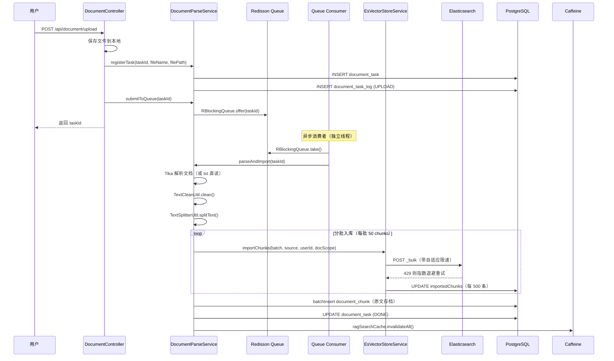
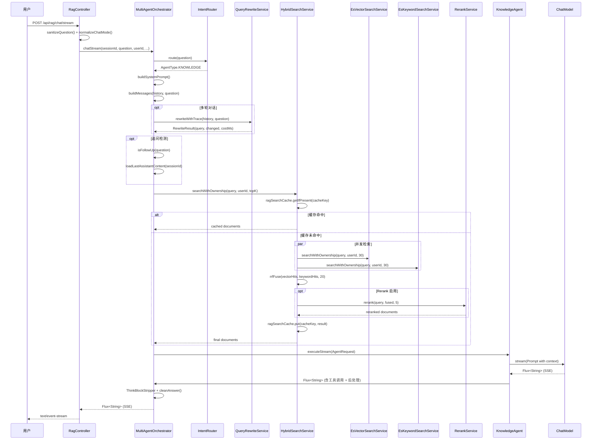

# 本地 AI 知识库系统 - 架构设计

## 一、项目概述

### 1.1 项目定位

基于 RAG（检索增强生成）架构的私有文档智能问答系统，支持 PDF/Word/Markdown/TXT 等多格式文档入库，通过向量检索 + BM25 关键词检索 + RRF 融合 + Cross-Encoder 重排序实现高精度召回，配合多 Agent 编排实现意图路由、知识库问答、网络搜索、文档概览等场景。

### 1.2 技术栈

- **后端框架**：Spring Boot 4.0.6 + Spring AI 2.0.0-M4 + Java 21
- **向量数据库**：Elasticsearch 9.x（主力，IK 分词）+ PostgreSQL + PgVector（降级）
- **消息队列**：Redisson（文档解析异步队列）
- **缓存**：Caffeine（本地缓存）+ Redis（会话历史）
- **认证授权**：Spring Security + JWT
- **可观测性**：Actuator + Prometheus + Micrometer
- **LLM 集成**：智谱 GLM-4-Flash / DeepSeek-V4-Flash（OpenAI 兼容协议）
- **Embedding**：智谱 Embedding-3（1024 维）
- **Rerank**：智谱 Rerank API（Cross-Encoder）

### 1.3 核心特性

| 特性 | 说明 |
|------|------|
| 双向量存储 | ES（@Primary，IK 分词）+ PgVector 降级，保证可用性 |
| 混合检索 | 向量召回 + BM25 关键词召回 + RRF 融合，兼顾语义与精确匹配 |
| 重排序 | Cross-Encoder Rerank 精排，提升 Precision@K |
| Query Rewrite | 多轮对话指代消解，支持历史窗口 + 超时降级 |
| 多 Agent 编排 | 意图路由 + 6 大 Agent（知识库/搜索/文档概览/热点/规划/聊天） |
| SSE 流式输出 | 首字延迟 <3s，完整答案实时流式返回 |
| 自适应限速 | 文档入库 429 自适应退避（TCP 拥塞控制思想） |
| 多层缓存 | Embedding 缓存 + 检索结果缓存 + SystemPrompt 缓存 |
| 熔断降级 | 检索层熔断器，连续失败自动熔断 30s |
| 用户自备模型 | 用户可配置自己的 ChatModel API Key（AES 加密入库） |
| MCP Server | 暴露知识库工具为 MCP 协议接口 |

---

## 二、整体架构

### 2.1 系统分层

```
┌─────────────────────────────────────────────────────────────┐
│                     接入层（Controller）                      │
│  RagController | DocumentController | AuthController        │
│  UserController | AdminController | SkillController        │
└─────────────────────────────────────────────────────────────┘
                              ↓
┌─────────────────────────────────────────────────────────────┐
│                     业务逻辑层（Service）                      │
│  ┌──────────────┐  ┌──────────────┐  ┌──────────────┐        │
│  │ 多 Agent 编排 │  │  混合检索    │  │  文档解析    │        │
│  │ Orchestrator │  │ HybridSearch │  │ DocumentParse│        │
│  └──────────────┘  └──────────────┘  └──────────────┘        │
│  ┌──────────────┐  ┌──────────────┐  ┌──────────────┐        │
│  │  Query 改写  │  │   Rerank     │  │  Embedding   │        │
│  │ QueryRewrite │  │ RerankService│  │ EmbeddingSvc │        │
│  └──────────────┘  └──────────────┘  └──────────────┘        │
└─────────────────────────────────────────────────────────────┘
                              ↓
┌─────────────────────────────────────────────────────────────┐
│                     数据访问层（Mapper/Store）                 │
│  MyBatis Mapper | VectorStore（ES/PG）| Redisson Redis       │
└─────────────────────────────────────────────────────────────┘
                              ↓
┌─────────────────────────────────────────────────────────────┐
│                     存储层                                    │
│  Elasticsearch | PostgreSQL | Redis | 文件系统（uploads/）  │
└─────────────────────────────────────────────────────────────┘
```

### 2.2 核心流程时序图

#### 2.2.1 文档入库流程



#### 2.2.2 RAG 问答流程



---

## 三、核心模块设计

### 3.1 双向量存储（ES + PgVector）

#### 3.1.1 设计目标

- **主力存储**：Elasticsearch，支持 IK 分词，向量 + 全文检索一体化
- **降级存储**：PostgreSQL + PgVector，ES 故障时自动降级
- **一致性**：文档删除/重新解析时同步清理两处数据

#### 3.1.2 实现细节

**ES 索引结构**（`VectorStoreConfig` 预创建 IK mapping）：

```json
{
  "mappings": {
    "properties": {
      "content": {
        "type": "text",
        "analyzer": "ik_max_word",
        "search_analyzer": "ik_smart"
      },
      "metadata": {
        "properties": {
          "source": {"type": "keyword"},
          "user_id": {"type": "keyword"},
          "doc_scope": {"type": "keyword"},
          "chunk_index": {"type": "integer"},
          "total_chunks": {"type": "integer"}
        }
      },
      "embedding": {
        "type": "dense_vector",
        "dims": 1024,
        "index": true,
        "similarity": "cosine"
      }
    }
  }
}
```

**注入方式**：

- `@Qualifier("esVectorStore")` → ElasticsearchVectorStore（@Primary）
- `@Qualifier("vectorStore")` → PgVectorStore（Spring AI 自动配置）

**降级策略**（`HybridSearchService#searchWithOwnership`）：

```
ES 向量检索成功 → 直接返回
ES 向量检索为空/失败 → 降级 PG 向量检索
两路均为空 → 返回空列表（由上层 Agent 走"基于通用知识回答"分支）
```

### 3.2 混合检索（向量 + BM25 + RRF）

#### 3.2.1 召回路数

| 路数 | 实现类 | 特点 |
|------|--------|------|
| 向量检索 | `EsVectorSearchService` | 语义相近，擅长同义词/改写 |
| BM25 关键词 | `EsKeywordSearchService` | 精确词命中，擅长专有名词/版本号 |

#### 3.2.2 RRF 融合算法

**公式**：

```
score(d) = Σ 1 / (k + rank_i(d))
```

- `rank_i(d)`：文档 d 在第 i 路召回中的排名（从 1 开始）
- `k`：平滑常数，默认 60（论文推荐值）

**优势**：

- 不依赖 score 量纲（向量 cosine vs BM25 完全不同尺度）
- 对单路漏召容错（只要另一路命中就能进 topK）
- 实现极简，工程稳定

**实现**（`HybridSearchService#rrfFuse`）：

```java
// 使用堆排序优化 O(n log k)
PriorityQueue<Map.Entry<String, Double>> pq = new PriorityQueue<>(
    (a, b) -> Double.compare(a.getValue(), b.getValue()));

// 累计 RRF 分数
for (Document doc : vectorHits) {
    double contribution = 1.0 / (rrfK + rank);
    rrfScores.merge(docId, contribution, Double::sum);
}

// 取 topK
for (Map.Entry<String, Double> entry : rrfScores.entrySet()) {
    if (pq.size() < topK) {
        pq.offer(entry);
    } else if (entry.getValue() > pq.peek().getValue()) {
        pq.poll();
        pq.offer(entry);
    }
}
```

#### 3.2.3 Rerank 精排

**位置**：RRF 融合后 → 返回最终 topK 前

**流程**：

```
RRF 取前 20 篇候选 → Rerank API 打分 → 过滤 score < 0.7 → 返回 top 5
```

**降级策略**：

- API 超时/失败 → 直接返回 RRF 结果
- 无 API Key → 跳过 Rerank

### 3.3 Query Rewrite（多轮对话指代消解）

#### 3.3.1 痛点

多轮对话中用户的追问通常包含指代（"它""这个""上面提到的"）或省略主语，直接用原始 query 做检索会导致召回质量骤降。

#### 3.3.2 方案

利用 LLM 将"聊天历史 + 当前追问"改写为一个独立、完整、适合检索的查询。

**设计要点**：

- 仅当存在历史消息时才改写（首轮直接用原始 query）
- 使用同一 ChatModel，单次 prompt 控制在 ~500 token，延迟 <1s
- 失败时静默回退到原始 query，不阻断主流程
- 可通过 `app.rag.query-rewrite.enabled` 全局开关

**System Prompt**（`QueryRewriteService#REWRITE_SYSTEM_PROMPT`）：

```
你是一个查询改写助手。你的唯一任务是将用户的最新追问改写为一个独立、完整、适合检索的查询语句。

规则：
1. 结合对话历史，将指代词（它、这个、那个、上面提到的）替换为具体实体
2. 补全省略的主语或宾语
3. 只输出改写后的查询，不要解释、不要加引号、不要加前缀
4. 如果追问本身已经是完整独立的查询，直接原样输出
5. 保留原始问题的语言（中文/英文）
6. 改写后的查询应简洁，适合搜索引擎或向量检索，不超过 100 字
```

### 3.4 多 Agent 编排

#### 3.4.1 Agent 类型

| Agent | 职责 | 工具 |
|-------|------|------|
| KnowledgeAgent | 知识库问答 | vector_search, keyword_search |
| DocumentSearchAgent | 文档搜索 | document_search |
| DocumentOverviewAgent | 文档概览 | document_overview |
| WebSearchAgent | 网络搜索 | web_search（Tavily API） |
| HotSearchAgent | 热点搜索 | hot_search |
| PlannerAgent | 规划代理 | 多步推理 + 工具调用 |
| ChatAgent | 纯聊天 | 无工具 |

#### 3.4.2 意图路由

**实现**：`IntentRouter`（基于 LLM 分类）

**路由逻辑**：

```
用户问题 → IntentRouter → AgentType → SpecializedAgent
```

**降级**：路由失败 → 默认 ChatAgent

#### 3.4.3 流式执行

**流程**：

```
MultiAgentOrchestrator.chatStream()
  ↓
构建 AgentRequest（含 RagToolContext）
  ↓
SpecializedAgent.executeStream()
  ↓
ChatModel.stream(Prompt)
  ↓
Flux<String>（原始 token 流）
  ↓
ThinkBlockStripper（过滤 <think> 块）
  ↓
cleanAnswer（正则清理）
  ↓
MetaBuilder（构建 [META]...[/META]）
  ↓
返回 SSE 流
```

**超时控制**：

- 首字超时：15s
- 空闲超时：25s
- 总体超时：由 Reactor 控制

### 3.5 缓存策略

#### 3.5.1 Embedding 缓存（`CachedEmbeddingModel`）

**命中场景**：

- `VectorStore#similaritySearch(query)` 内部为 query 计算 embedding（每次问答 1 次）
- PlannerAgent 多轮检索时同义子 query 重复 embed

**规则**：

- 仅缓存单条调用（`request.instructions.size() == 1`）
- 批量调用（文档 ingestion）直接透传
- key 为单条 instruction 文本本身；value 为 `float[]`
- 命中时返回新构造的 `EmbeddingResponse`，不复用 metadata

**容量 / TTL**：

- maxSize = 2000（约 8MB）
- expireAfterWrite = 10 min

#### 3.5.2 检索结果缓存（`ragSearchCache`）

**Key**：`userId|topK|rerankSig|query`

**TTL**：10 min

**失效策略**：

- 文档入库/删除时主动 `invalidateAll()`
- 避免出现"刚上传的文档检索不到"的错误

### 3.6 熔断降级

#### 3.6.1 熔断器实现（`SimpleCircuitBreaker`）

**状态机**：

```
CLOSED → 连续失败 5 次 → OPEN（熔断 30s）→ HALF_OPEN → 成功 → CLOSED
                                      ↓
                                    失败 → OPEN
```

**行为**：

- 熔断时直接返回空列表，不抛异常打断 chat 流
- 上层 Agent 走"基于通用知识回答"分支兜底

#### 3.6.2 指标暴露（`RagMetrics`）

```
rag.search.breaker.total       # 总调用次数
rag.search.breaker.rejected    # 被熔断拒绝次数
rag.search.breaker.failed      # 失败次数
rag.search.breaker.state       # 状态（0=CLOSED, 1=HALF_OPEN, 2=OPEN）
```

### 3.7 文档解析与入库

#### 3.7.1 解析策略

- **TXT 文件**：绕过 Tika，直接读取并自动检测编码（UTF-8 → GB18030 → 系统默认）
- **其他格式**：使用 `TikaDocumentReader`（PDF/Word/HTML 等）

#### 3.7.2 切分策略（`TextSplitterUtil`）

- 固定长度切分（默认 500 字符）
- 重叠窗口（默认 50 字符）
- 清洗规则（`TextCleanUtil`）：去空白、去特殊字符、去 HTML 标签

#### 3.7.3 入库策略

**ES 向量入库**（`EsVectorStoreService#importChunks`）：

- 分批：每批 50 chunks
- 自适应限速：类似 TCP 拥塞控制
  - 初始暂停 0ms（全速消耗桶容量）
  - 遇到 429 → 暂停递增 2000ms，并指数退避重试
  - 成功无 429 → 暂停递减 500ms（最低 0）
  - 自动收敛到最优吞吐速率
- 进度回调：每 500 chunks 更新一次 DB（避免频繁写库）

**PG 双写**（可选）：

- 大文件建议关闭（避免存储成本）
- 仅在 ES 故障时降级使用

### 3.8 安全与权限

#### 3.8.1 认证授权

- **认证**：JWT Token（`JwtAuthenticationFilter`）
- **授权**：Spring Security（`SecurityConfig`）
- **角色**：ADMIN / USER

#### 3.8.2 文档权限

**字段**：`doc_scope`（PUBLIC / PRIVATE）

**过滤逻辑**：

```
(doc_scope == PUBLIC) OR (doc_scope == PRIVATE AND user_id == userId)
```

**实现**：`FilterExpressionBuilder`（ES）+ SQL WHERE（PG）

#### 3.8.3 限流

**匿名用户**：

- 每窗口最大请求数：20
- 窗口大小：60 min

**已认证用户**：

- 单用户 QPS：2
- 单用户每日上限：200
- 单 IP QPS：5（同 IP 多账号防刷）

### 3.9 可观测性

#### 3.9.1 Actuator Endpoint

```
/actuator/health      # 健康检查
/actuator/info        # 应用信息
/actuator/metrics     # Micrometer 指标
/actuator/prometheus  # Prometheus 格式（Grafana 抓取）
```

#### 3.9.2 自定义指标（`RagMetrics`）

```
rag.embed.cache.requests      # Embedding 缓存请求次数
rag.embed.cache.hits         # Embedding 缓存命中次数
rag.embed.cache.hit_rate     # Embedding 缓存命中率
rag.chat.error.total{code}   # Chat 错误计数（按错误码拆分）
rag.chat.duration{model}     # Chat 单次耗时（按模型拆分）
```

---

## 四、技术选型理由

### 4.1 为什么选择 Elasticsearch + PgVector 双存储？

- **Elasticsearch**：向量 + 全文检索一体化，IK 分词对中文友好，生态成熟
- **PgVector**：PostgreSQL 扩展，成本低，适合降级场景
- **双存储**：保证可用性，ES 故障时自动降级，不影响用户体验

### 4.2 为什么选择 RRF 融合而非加权融合？

- **RRF**：不依赖 score 量纲，实现极简，工程稳定
- **加权融合**：需要人工调参（向量权重 vs BM25 权重），难以泛化

### 4.3 为什么选择 Redisson 而非 Spring Redis？

- **分布式队列**：Redisson 提供阻塞队列（`RBlockingQueue`），原生支持消费者模式
- **分布式锁**：未来可扩展分布式场景
- **API 友好**：比 Spring Redis 更简洁

### 4.4 为什么选择 Caffeine 而非 Redis 缓存？

- **本地缓存**：命中速度更快（无网络开销）
- **Caffeine**：性能优于 Guava Cache，支持异步加载、过期策略丰富
- **Redis**：用于会话历史（需要跨实例共享）

### 4.5 为什么选择 SSE 而非 WebSocket？

- **SSE**：单向流式推送，适合问答场景
- **WebSocket**：双向通信，复杂度高，当前场景不需要

---

## 五、部署架构

### 5.1 单机部署

```
┌─────────────────────────────────────────────────────────────┐
│                     应用服务器                                │
│  Spring Boot (port: 12116)                                  │
└─────────────────────────────────────────────────────────────┘
                              ↓
┌─────────────────────────────────────────────────────────────┐
│                     中间件                                    │
│  Elasticsearch (9200) | PostgreSQL (5432) | Redis (6379)    │
└─────────────────────────────────────────────────────────────┘
```

### 5.2 生产环境建议

- **应用层**：多实例部署 + Nginx 负载均衡
- **数据库层**：ES 集群 + PG 主从 + Redis 哨兵
- **监控层**：Prometheus + Grafana + AlertManager
- **日志层**：ELK Stack

---

## 六、未来优化方向

### 6.1 检索效果提升

- **评测体系**：构造评测集，跑 Recall@K / MRR / nDCG
- **语义分块**：基于语义相似度的动态分块
- **HyDE**：用 LLM 生成"假设性答案"再 embedding 检索
- **多查询扩展**：用 LLM 生成多个子查询并行检索

### 6.2 成本优化

- **语义缓存**：基于 embedding 相似度的历史答案复用
- **Token 计量**：按用户/模型统计 token 消耗，估算成本

### 6.3 安全增强

- **Prompt 注入防御**：关键词/正则黑名单 + 输入输出隔离标签
- **PII 脱敏**：入库前/LLM 调用前对敏感信息脱敏

### 6.4 功能扩展

- **多模态**：图片/表格入库与检索
- **Agent 工具市场化**：动态注册工具
- **灰度 / A/B 测试**：不同用户走不同检索策略
